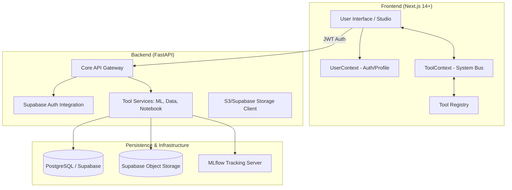

# Unified Tool Architecture (UTA) Documentation

## 1. Overview
The **The Insighter Enterprise** is built on a modular, project-centric architecture that bridges the gap between local experimentation and production-grade ML operations. The core of this system is the **Unified Tool Architecture (UTA)**, which allows disparate tools (Notebooks, Data Managers, Experiment Trackers) to operate in isolated environments while maintaining seamless communication via a shared **System Bus**.

## 2. System Architecture

### 2.1 High-Level Component Relationship



### 2.2 The System Bus (UTA Core)
The System Bus, implemented via [ToolContext.tsx](file:///d:/The-Insighter-Enterprise/frontend/contexts/ToolContext.tsx), follows a Publish/Subscribe pattern with strict schema validation and access controls.

- **Message Dispatcher**: Handles the routing of events between active tools.
- **Schema Validator**: Uses [Zod](file:///d:/The-Insighter-Enterprise/frontend/lib/tools/schemas.ts) to ensure every message adheres to the expected structure.
- **Access Control List (ACL)**: Restricts which tools can communicate based on the `allowedSources` definition in the [tools.ts](file:///d:/The-Insighter-Enterprise/frontend/lib/constants/tools.ts) registry.
- **Dead Letter Queue (DLQ)**: Captures invalid or failed messages for observability and debugging.

## 3. Technology Stack

| Layer | Technology | Purpose |
|-------|------------|---------|
| **Frontend** | Next.js 14 (App Router) | High-performance, SEO-friendly React framework. |
| **State Management** | Context API / Zod | Global user state and type-safe tool communication. |
| **Backend** | FastAPI (Python 3.11+) | Asynchronous, high-performance API services. |
| **Database** | PostgreSQL (Supabase) | Relational storage with Row-Level Security (RLS). |
| **Authentication** | Supabase Auth (JWT) | Secure, managed user authentication. |
| **ML Tracking** | MLflow | Experiment tracking and model versioning. |
| **Storage** | Supabase Storage (S3) | Large artifact and dataset management. |
| **Styling** | Tailwind CSS / Framer Motion | Modern, responsive UI with smooth transitions. |

## 4. Data Flow

1.  **Authentication**: User logs in via Supabase; the frontend receives a JWT and stores it in [UserContext.tsx](file:///d:/The-Insighter-Enterprise/frontend/contexts/UserContext.tsx).
2.  **API Requests**: Every request to the FastAPI backend is intercepted by [api.ts](file:///d:/The-Insighter-Enterprise/frontend/lib/api.ts) to attach the `Authorization: Bearer <token>` header.
3.  **Tool Communication**:
    -   **Notebook Tool** emits a `DATA_LOAD` event.
    -   **System Bus** validates the message against `DataLoadSchema`.
    -   **Data Tool** (if subscribed) receives the event and updates its internal state.
4.  **Persistence**: Backend services interact with Supabase via the service role for administrative tasks or the user's JWT for RLS-protected data.

## 5. Integration Guide: Adding a New Tool

### Step 1: Register Metadata
Add the tool definition to [tools.ts](file:///d:/The-Insighter-Enterprise/frontend/lib/constants/tools.ts).
```typescript
{
  id: 'new-tool-id',
  name: 'New Tool',
  environmentType: 'notebook', // data, experiment, labeling, deployment
  allowedSources: ['system', 'python'], // ACL
}
```

### Step 2: Define Message Schemas
Extend the [schemas.ts](file:///d:/The-Insighter-Enterprise/frontend/lib/tools/schemas.ts) if your tool requires new event types.

### Step 3: Implement Frontend Environment
Create a component in `frontend/components/studio/environments/` and use the `useToolCommunication` hook to interface with the System Bus.

---
*Last Updated: 2026-02-13 | Version: 1.1.0*
